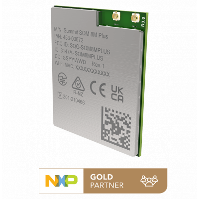

.. _summit_som8mplus_dvk:

Laird Connectivity Summit SOM 8M Plus DVK
#########################################

Overview
********

More information about the board can be found at the
`Laird Connectivity website`_.

Supported Features
==================

The Zephyr summit_som8mplus_dvk board configuration supports the following
hardware features:

+-----------+-------------------+------------------------------------+
| Interface | Controller        | Driver/Component                   |
+===========+===================+====================================+
| NVIC      | on-chip           | nested vector interrupt controller |
+-----------+-------------------+------------------------------------+
| SYSTICK   | on-chip           | systick                            |
+-----------+-------------------+------------------------------------+
| CLOCK     | on-chip           | clock_control                      |
+-----------+-------------------+------------------------------------+
| PINMUX    | on-chip           | pinmux                             |
+-----------+-------------------+------------------------------------+
| UART      | on-chip           | | serial port-polling;             |
|           |                   | | serial port-interrupt            |
+-----------+-------------------+------------------------------------+
| I2C       | on-chip           | i2c                                |
+-----------+-------------------+------------------------------------+
| GPIO      | | on-chip         | | gpio                             |
|           | | i2c io expander | | i2c, gpio                        |
+-----------+-------------------+------------------------------------+
| GPT       | on-chip           | timer                              |
+-----------+-------------------+------------------------------------+
| MU        | on-chip           | ipc                                |
+-----------+-------------------+------------------------------------+
| ECSPI     | on-chip           | spi                                |
+-----------+-------------------+------------------------------------+
| FLEXSPI   | on-chip           | spi_flash                          |
+-----------+-------------------+------------------------------------+
| WDOG      | on-chip           | watchdog                           |
+-----------+-------------------+------------------------------------+
| FLEXCAN   | on-chip           | can                                |
+-----------+-------------------+------------------------------------+
| PWM       | on-chip           | pwm                                |
+-----------+-------------------+------------------------------------+

The default configuration can be found in the defconfig files:
:zephyr_file:`summit_som8mplus_itcm_dvk_defconfig`.
:zephyr_file:`summit_som8mplus_ddr_dvk_defconfig`.

Other hardware features are not currently supported by the port.

Connections and IOs
===================

The Summit SOM 8M Plus DVK board was tested with the following pinmux controller
configuration.

+-------------+-----------+--------------+-------------------------------------+
| Board Name  | SoC Name  | Usage        | Connector/Pin                       |
+=============+===========+==============+=====================================+
| Debug UART  | UART4_TXD | UART Console | | DVK: J2 (USB virtual serial port) |
|             |           |              | | SOM: A26                          |
+-------------+-----------+--------------+-------------------------------------+
| Debug UART  | UART4_RXD | UART Console | | DVK: J2 (USB virtual serial port) |
|             |           |              | | SOM: A27                          |
+-------------+-----------+--------------+-------------------------------------+

System Clock
============

The M7 Core is configured to run at a 800 MHz clock speed.

Serial Port
===========

The i.MX8M Plus SoC (the MPU inside the Summit SOM 8M Plus) has four UARTs.
UART_4 is configured for the console and the remaining are not used/tested.

Programming and Debugging
*************************

The A53 core is responsible to load the M7 binary
application into the RAM, put the M7 in reset, set the M7 Program Counter and
Stack Pointer, and get the M7 out of reset. The A53 can perform these steps at
bootloader level or after the Linux system has booted.

The M7 can use up to 3 different RAMs (currently, only two configurations are
supported: ITCM and DDR). These are the memory mapping for A53 and M7:

+------------+-------------------------+------------------------+-----------------------+----------------------+
| Region     | Cortex-A53              | Cortex-M7 (System Bus) | Cortex-M7 (Code Bus)  | Size                 |
+============+=========================+========================+=======================+======================+
| OCRAM      | 0x00900000-0x0098FFFF   | 0x20200000-0x2028FFFF  | 0x00900000-0x0098FFFF | 576KB                |
+------------+-------------------------+------------------------+-----------------------+----------------------+
| DTCM       | 0x00800000-0x0081FFFF   | 0x20000000-0x2001FFFF  |                       | 128KB                |
+------------+-------------------------+------------------------+-----------------------+----------------------+
| ITCM       | 0x007E0000-0x007FFFFF   |                        | 0x00000000-0x0001FFFF | 128KB                |
+------------+-------------------------+------------------------+-----------------------+----------------------+
| OCRAM_S    | 0x00180000-0x00188FFF   | 0x20180000-0x20188FFF  | 0x00180000-0x00188FFF | 36KB                 |
+------------+-------------------------+------------------------+-----------------------+----------------------+
| DDR        | 0x80000000-0x803FFFFF   | 0x80200000-0x803FFFFF  | 0x80000000-0x801FFFFF | 2MB                  |
+------------+-------------------------+------------------------+-----------------------+----------------------+

For more information about memory mapping see the
`i.MX 8M Plus Applications Processor Reference Manual`_  (section 2.1 to 2.3)

At compilation time you have to choose which RAM will be used. This
configuration is done based on board name (summit_som8mplus_dvk_itcm for ITCM
and summit_som8mplus_dvk_ddr for DDR).

Load and run Zephyr on the M7 core from the A53 core using u-boot by copying the
compiled ``zephyr.bin`` to the first FAT partition of the SD card and plug the
SD card into the board. Power it up and stop the u-boot execution at prompt.

Debugging
=========

The Summit SOM 8M Plus DVK board can be debugged by connecting an external JLink
JTAG debugger to the J15 debug connector and to the PC. Then
the application can be debugged using the usual way.

Here is an example for the :ref:`hello_world` application.

.. zephyr-app-commands::
   :zephyr-app: samples/hello_world
   :board: summit_som8mplus_dvk_itcm
   :goals: debug

Open a serial terminal, step through the application in your debugger, and you
should see the following message in the terminal:

.. code-block:: console

   *** Booting Zephyr OS build zephyr-v2.7.1-131-ge9ac3c4430f9  ***
   Hello World! summit_som8mplus_dvk

Flashing and Booting the M7 Core
********************************
Below are the set of U-Boot commands to load and boot the M7 core. Currently,
two run-modes are supported: ITCM and DDR. These steps assume the Zephyr binary
(``zephyr.bin``) has been copied to the ``boot`` directory of the microSD card.

Flash and Boot M7 Core in ITCM Run-mode
=======================================
.. code-block:: console

    fatload mmc 1:1 0x48000000 zephyr.bin
    cp.b 0x48000000 0x7e0000 20000
    bootaux 0x7e0000

Flash and Boot M7 Core in DDR Run-mode
======================================
.. code-block:: console

    fatload mmc 1:1 0x80000000 zephyr.bin
    dcache flush
    bootaux 0x80000000

References
**********

.. target-notes::

.. _Laird Connectivity website: https://www.lairdconnect.com/wireless-modules/system-on-module/summit-som-8m-plus-system-module-wifi-5-bluetooth-53
.. _i.MX 8M Plus Applications Processor Reference Manual: https://www.nxp.com/webapp/Download?colCode=IMX8MPRM
